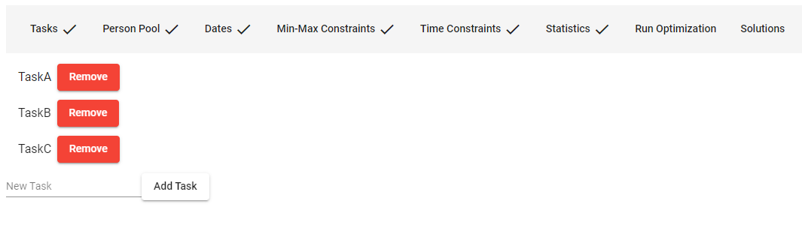
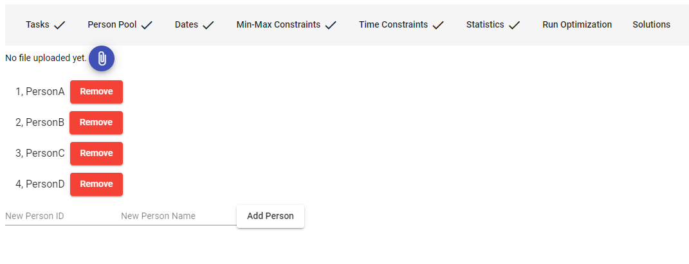
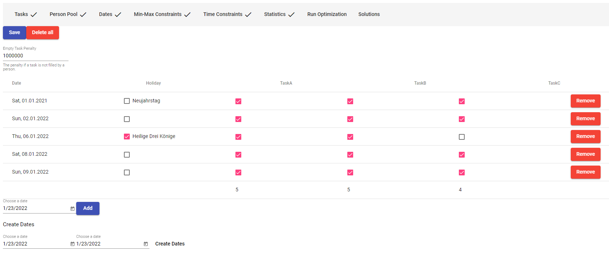
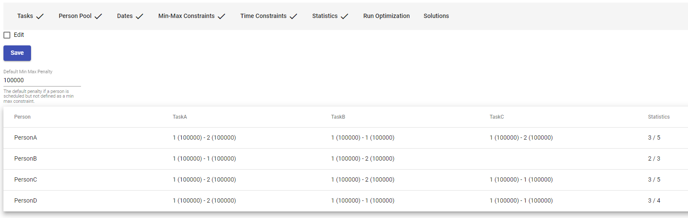
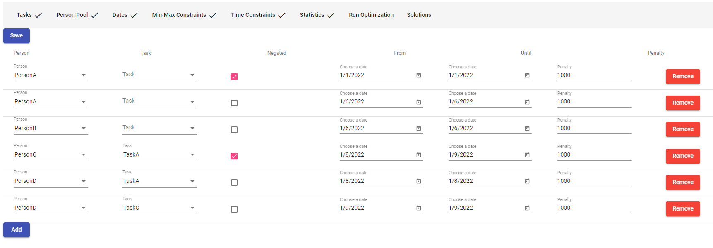
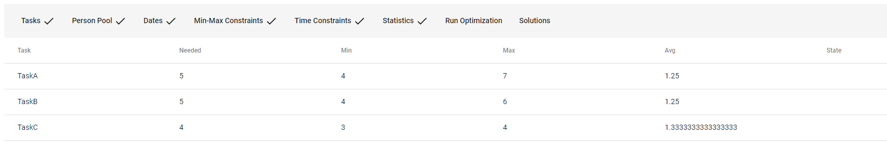
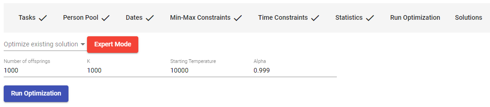
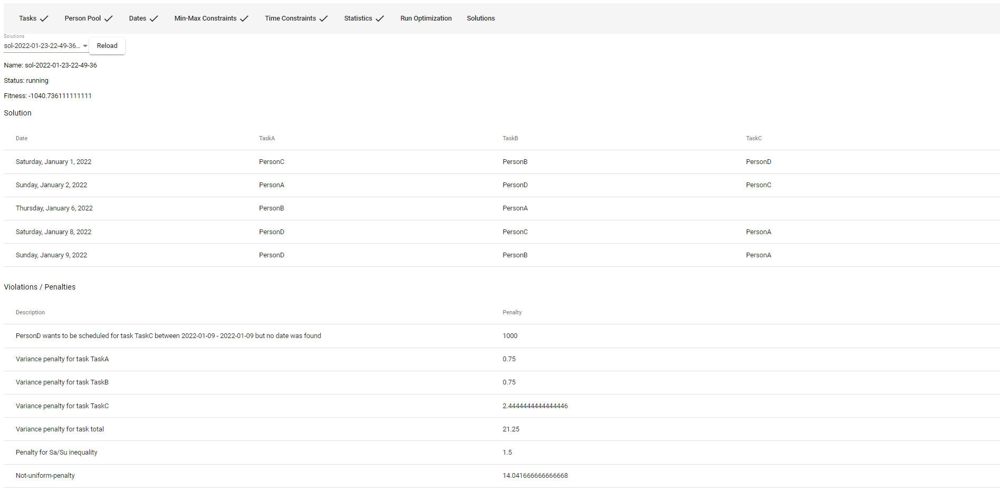
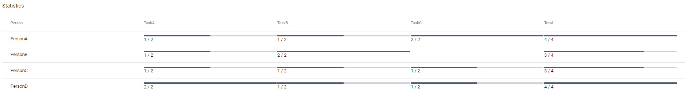

# Simulated Annealing Scheduler

This client-server app creates and optimizes schedules based on defined constraints.
It uses [Simulated Annealing](https://en.wikipedia.org/wiki/Simulated_annealing).

> Disclaimer: This is a port of an app I created for my flying club "SFG Singen-Hilzingen." It has been used for several years to make the yearly schedule.
> The club members can define dates where they would like to be scheduled, or date ranges where they would not want to be scheduled. This part is, however, not included in this port.

## Usage

To run this, simply use

```
docker run -p "80:8000" wjentner/simulated-annealing-scheduler:latest
```

Then go to your browser and open http://localhost:8000.


The following constraints can be defined using the webapp:

### Tasks



Create one or multiple tasks that persons should be scheduled for.


### Person Pool



Create persons that later on can be selected from in various constraints.


### Dates



Create some dates and enable the checkbox for a task if a person should be scheduled on that day and for this task.
You can also select whether this date is a holiday.

### Min-Max-Constraints



This view allows you to specify which person should be scheduled for which task (and how many times).
For example, PersonA should be scheduled for TaskA at least once and at a maximum of two times.
If the person is scheduled less or more, 100.000 penalty points will be added to the solution.


### Time-Constraints



In this view, you can set time constraints for persons.
That is, whether a person should be scheduled within a specific time range or should *not* be scheduled within a given time range.
An optional argument is the task.
For example, in the fourth row of the screenshot, you can see that PersonC should *not* be scheduled for TaskA on the 8th and 9th of January 2022.
Below, PersonD *should* be scheduled for TaskA on the 8th of January 2022.
If these constraints are not satisfied, a penalty of 1000 will be added to the solution.


### Statistics



The statistics overview provides basic statistics such as how many schedules (aka dates) are available (*Needed* in the screenshot) for a specific task and whether the summed min-max constraints for this task are within that range.
It is possible to calculate a solution when the number of schedules is outside the min-max constraints, but penalties will be added to that solution.


### Run Optimization



Here you can start a new optimization run. This can be either started from a random solution or from a specific solution that has already been calculated.
The latter is helpful if, for example, some constraints have been modified after the solution was created.
Various other parameters can be modified, but the defaults are typically sufficient.

> Note that an optimization run can take several hours depending on the amounts of tasks and dates.

### Solutions



All of the calculated solutions can be selected from the solutions view. The top shows the state of the solution and its fitness.
The fitness is negative and based on the penalties, which are subtracted from the fitness. Therefore, the optimal solution would have 0 (zero) fitness.
This is, however, unlikely, as, besides defined constraints, other constraints such as variances are subtracted from the fitness.

Below the state information, the actual schedule of the solution is displayed as a table.
Below that, the penalties for this solution are listed.
The variance penalties ensure that the solution is as fair as possible, namely, that persons are as evenly scheduled as possible.
The Sa/Su inequality optimizes that persons are scheduled evenly for Saturdays and Sundays.
The not-uniform penalty ensures that persons are distributed over the whole time range of the schedule and are not clustered.
Note that these penalties are much lower than the user-defined constraints, which makes the latter the precedence of the solution.



The statistics below the penalties show the number of schedules for each person and task.
You can verify here that the solution is as fair as possible.
